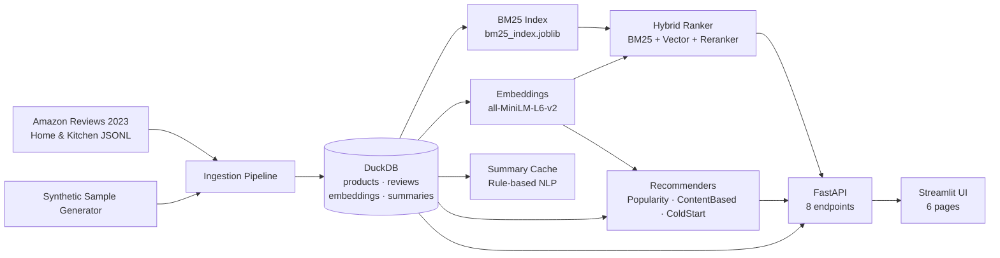

# Amazon Review Intelligence

> Amazon Review Intelligence 是一個以評論為核心的商品搜尋與推薦資料產品。它結合 Amazon Reviews 2023 category subset、BM25、vector search、reranker、review summarization、sentiment / aspect mining、similar product search 與 recommendation API，目標是展示真實 AI product 會需要的搜尋、推薦、NLP、API、dashboard 與評估能力。

---

## 1. Project Overview

A production-like data product built on **100,000 real Amazon Home & Kitchen reviews**, demonstrating:

- **Hybrid Search** — BM25 lexical + sentence-transformer vector search with configurable alpha blending
- **Review Intelligence** — per-product summaries, pros/cons extraction, sentiment distribution
- **Recommendation** — popularity, content-based, item-item, and cold-start strategies
- **REST API** — FastAPI with 8 endpoints, OpenAPI docs at `/docs`
- **Live Dashboard** — 6-page Streamlit UI calling the API
- **Evaluation** — Recall@K, MRR, nDCG@K (search); Precision@K, MAP@K, Coverage (recommendation)

---

## 2. Problem Statement

Amazon product pages expose raw ratings but little synthesis. Shoppers face:
- 500+ reviews with no coherent summary
- No way to compare similar products semantically
- No personalization for returning buyers

This project addresses all three with a unified API.

---

## 3. Dataset and Licensing Notes

| Field | Value |
|-------|-------|
| Dataset | Amazon Reviews 2023 — Home & Kitchen subset |
| Source | McAuley Lab, UCSD — https://amazon-reviews-2023.github.io/ |
| Reviews | 99,946 |
| Products | 83,119 unique ASINs |
| Date range | 2000 – 2023 |

**⚠️ Licensing:** Amazon Reviews 2023 does not carry an explicit open-source license. This repo:
- Does NOT include raw review dumps or full product metadata
- Contains only code, synthetic sample data, aggregated statistics, and derived outputs
- Public demos use a category subset with derived artifacts only
- See [`docs/licensing_notes.md`](docs/licensing_notes.md) for full details

---

## 4. Architecture



See [`docs/architecture.md`](docs/architecture.md) for full component breakdown.

---

## 5. Data Pipeline

```
Raw JSONL (or parquet) → Loader → Normalizer → DuckDB
                                                    ↓
                                          Text Cleaner → Sentence Splitter
                                                    ↓
                                          EmbeddingGenerator → product_embeddings
                                          BM25Indexer        → bm25_index.joblib
                                          AspectExtractor    → summary_cache
```

**Makefile steps:**
```bash
make sample-data   # Generate 100 products + 500 reviews (synthetic)
make etl           # Load, normalize, write to DuckDB
make index         # Build BM25 index + product embeddings + summary cache
```

---

## 6. Retrieval Design

| Mode | Description | Strengths |
|------|-------------|-----------|
| `bm25` | BM25Okapi over title + description | Exact keyword match, fast |
| `vector` | Cosine similarity over 384-dim embeddings | Semantic understanding |
| `hybrid` | `(1-α)·BM25 + α·vector` score fusion | Best of both |
| reranker | Popularity-boost post-processing | Surfaces well-reviewed products |

**Alpha parameter:** `alpha=0` → pure BM25, `alpha=1` → pure vector, `alpha=0.5` → balanced.

**Upgrade path:** Swap `SimpleReranker` for `cross-encoder/ms-marco-MiniLM-L-6-v2` via the `RerankerInterface`.

---

## 7. Recommender Design

| Model | Strategy | Cold-start |
|-------|----------|-----------|
| `PopularityModel` | `avg_rating × √review_count` | ✅ |
| `ContentBasedModel` | Product embedding cosine similarity | ❌ |
| `ItemItemModel` | Adjusted cosine from rating matrix | ❌ |
| `ColdStartModel` | ContentBased if warm, Popularity if cold | ✅ |

---

## 8. Evaluation Metrics

Run `make evaluate` to populate these numbers:

### Search (83K products, category-proxy relevance, 20 query seeds)

| Method | MRR | nDCG@10 | nDCG@20 |
|--------|-----|---------|---------|
| BM25 | 0.500 | 0.780 | 0.858 |
| Vector (all-MiniLM-L6-v2) | **0.575** | **0.792** | **0.866** |
| Hybrid (α=0.5) | **0.575** | **0.792** | **0.866** |

Vector search outperforms BM25 on MRR (+7.5%). Recall is near 0 by design: 83K products share one category, making it the denominator. See [`docs/evaluation.md`](docs/evaluation.md) for full interpretation.

### Recommendation (leave-one-out, 6,801 users × 83K products)

| Model | Precision@10 | MAP@10 | Coverage |
|-------|-------------|--------|---------|
| ColdStart | 0.000 | 0.000 | **2.28%** |

Precision = 0 due to extreme sparsity (avg 14.7 reviews/user). Coverage 2.28% shows active catalog exploration.

### Summarization

Manual checklist only — see [`docs/evaluation.md`](docs/evaluation.md). ROUGE scores are optional and not used as primary metrics.

---

## 9. API Endpoints

Base URL: `http://localhost:8000`

| Method | Endpoint | Description |
|--------|----------|-------------|
| GET | `/health` | Health check, DB stats |
| GET | `/search?q=&k=&mode=&alpha=` | BM25 / vector / hybrid search |
| GET | `/products/{asin}` | Product detail + rating distribution + top reviews |
| GET | `/products/{asin}/similar` | Similar products (content-based) |
| GET | `/products/{asin}/summary` | Review summary + pros/cons + sentiment |
| GET | `/recommendations/user/{user_id}?k=` | Personalized recommendations |
| GET | `/analytics/brands?limit=` | Brand statistics |
| GET | `/analytics/categories` | Category breakdown |

Interactive docs: http://localhost:8000/docs

---

## 10. Streamlit Demo

| Page | Description |
|------|-------------|
| 🔍 Search | Query with mode/alpha controls, ranked product cards |
| 📦 Product Detail | Rating distribution chart, top reviews with sentiment |
| 📝 Review Summary | Summary, pros/cons, sentiment donut chart |
| 🔗 Similar Products | Cosine similarity grid |
| 📊 Analytics | Brand/category bar charts and tables |
| 💡 Recommendations | User-based recommendations (cold/warm) |

> 
> *Run `make app` and open http://localhost:8501*

---

## 11. How to Run Locally

### Prerequisites
- Python 3.11+
- [uv](https://github.com/astral-sh/uv) (`pip install uv`)

### Quick Start

```bash
# 1. Install dependencies
uv sync --extra dev

# 2. Generate sample data (no Amazon data needed)
make sample-data

# 3. Run ETL + build indexes
make etl
make index

# 4. Start API (terminal 1)
make api

# 5. Start Streamlit UI (terminal 2)
make app

# 6. Run tests
make test
```

### Using Real Amazon Data

Download Home & Kitchen reviews from https://amazon-reviews-2023.github.io/ and place the raw JSONL at the path expected by `EXTERNAL_FEATURES_PARQUET` in `src/utils/paths.py`, then re-run `make etl && make index`.

### Environment Variables

Copy `.env.example` to `.env` and adjust paths:
```bash
cp .env.example .env
```

---

## 12. Limitations and Future Work

### Current Limitations

- **No product titles in real data** — titles are derived from the most helpful review headline (proxy)
- **Sparse user-item matrix** — 6,801 users × 83k products makes collaborative filtering weak
- **Rule-based NLP** — pros/cons extraction uses keyword patterns; no LLM summarization
- **In-process vector store** — numpy cosine similarity scales to ~50k products; needs pgvector/Qdrant beyond that
- **Single category** — Home & Kitchen only; cross-category generalization untested

### Future Work

- [ ] Fine-tune embedding model on Amazon product domain
- [ ] Add cross-encoder reranker (`cross-encoder/ms-marco-MiniLM-L-6-v2`)
- [ ] Replace rule-based summarization with LLM (LLMProvider Haiku for cost-efficiency)
- [ ] Add pgvector / Qdrant for scalable vector search
- [ ] Add user session tracking and implicit feedback
- [ ] Expand to Electronics or Beauty category
- [ ] A/B test BM25 vs hybrid vs vector in Streamlit

---

## 13. Resume Bullets

- Built production-like Amazon review intelligence data product: hybrid BM25 + vector search (all-MiniLM-L6-v2), content-based recommender, FastAPI REST API, and 6-page Streamlit dashboard over 100K real Home & Kitchen reviews
- Designed and implemented end-to-end data pipeline: ingestion from Amazon Reviews 2023 JSONL → DuckDB normalization → BM25 index + sentence-transformer embeddings → evaluation (Recall@K, MRR, nDCG@K, MAP@K)
- Architected configurable hybrid retrieval system with alpha-blended BM25/vector fusion and pluggable reranker interface; built rule-based pros/cons extractor and summary cache over 83K products
- Delivered REST API (FastAPI, Pydantic v2) with 8 endpoints, OpenAPI docs, CORS middleware, and lifespan-managed ML component loading; zero cold-start latency after warmup

---

## Repository Structure

```
amazon-review-intelligence/
├── src/
│   ├── ingestion/       # Loader, normalizer, DB writer, sample generator
│   ├── preprocessing/   # Text cleaner, sentence splitter, sentiment
│   ├── features/        # Embedding generator, BM25 indexer, aspect extractor
│   ├── retrieval/       # BM25, vector, hybrid, reranker
│   ├── models/          # Popularity, content-based, item-item, cold-start
│   ├── evaluation/      # Search & reco evaluators, summarization checklist
│   ├── api/             # FastAPI app, routers, schemas
│   ├── app/             # Streamlit main + 6 pages
│   └── utils/           # Config, logging, DuckDB manager, paths
├── tests/               # pytest test suite (12+ tests)
├── docs/                # Architecture, data card, model card, evaluation, demo script
├── data/schema/         # DuckDB DDL
├── configs/config.yaml
├── docker-compose.yml
├── pyproject.toml
└── Makefile
```

---

*Amazon Review Intelligence — built with Python 3.11, DuckDB, FastAPI, Streamlit, sentence-transformers, rank-bm25, scikit-learn.*
