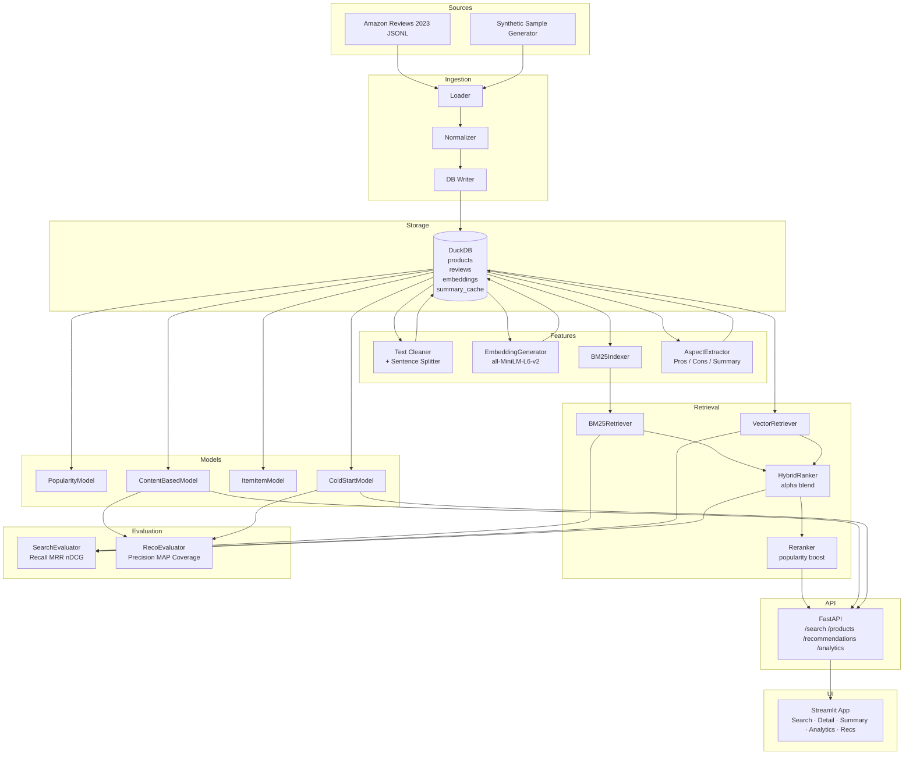

# Architecture

## System Overview

Amazon Review Intelligence is structured as a modular data product with clearly separated concerns:

```
Data Sources → Ingestion → DuckDB → Features → Retrieval / Models → API → UI
```

## Mermaid Diagram



## Component Responsibilities

| Component | Module | Responsibility |
|-----------|--------|----------------|
| Loader | `src/ingestion/loader.py` | Read JSONL/gz/parquet from disk |
| Normalizer | `src/ingestion/normalizer.py` | Map raw fields → DB schema |
| DB Writer | `src/ingestion/db_writer.py` | Upsert DataFrames into DuckDB |
| Text Cleaner | `src/preprocessing/text_cleaner.py` | Strip HTML, normalize, truncate |
| EmbeddingGenerator | `src/features/embedding_generator.py` | Batch encode with sentence-transformers |
| BM25Indexer | `src/features/bm25_indexer.py` | Build and persist BM25 index |
| AspectExtractor | `src/features/aspect_extractor.py` | Rule-based pros/cons/summary |
| BM25Retriever | `src/retrieval/bm25_retriever.py` | Lexical search |
| VectorRetriever | `src/retrieval/vector_retriever.py` | Cosine similarity over DuckDB embeddings |
| HybridRanker | `src/retrieval/hybrid_ranker.py` | Alpha-blended score fusion |
| Reranker | `src/retrieval/reranker.py` | Popularity-aware score boosting |
| PopularityModel | `src/models/popularity_model.py` | avg_rating × sqrt(rating_count) |
| ContentBasedModel | `src/models/content_based.py` | Product embedding cosine similarity |
| ItemItemModel | `src/models/item_item.py` | Adjusted cosine from rating matrix |
| ColdStartModel | `src/models/cold_start.py` | Content-based if warm, else popularity |
| FastAPI | `src/api/main.py` | REST API, lifespan model loading |
| Streamlit | `src/app/main.py` | 6-page demo UI via API |

## Storage Design

All data lives in a single DuckDB file (`data/amazon_reviews.duckdb`):
- **No separate vector database** for MVP — embeddings stored as `FLOAT[]` columns. Suitable for ≤50k products. For production: swap to pgvector or Qdrant.
- **BM25 index** serialized to `data/bm25_index.joblib` (separate from DB, lives on disk).
- **Summary cache** pre-computed and stored in DuckDB to avoid recomputing on each API call.

## Key Design Decisions

1. **DuckDB over PostgreSQL for MVP** — zero-config, file-based, analytical queries fast
2. **Pydantic-settings** — config from YAML + `.env` override, no hardcoded paths
3. **FastAPI lifespan** — BM25 index and embeddings loaded once at startup, shared via `state.py`
4. **Streamlit calls API** — not DB directly, ensuring UI and API stay decoupled
5. **Rule-based NLP** — pros/cons/summary via regex signal words; no LLM dependency for MVP
6. **Reranker interface** — MVP uses popularity boost; ready to swap in cross-encoder
